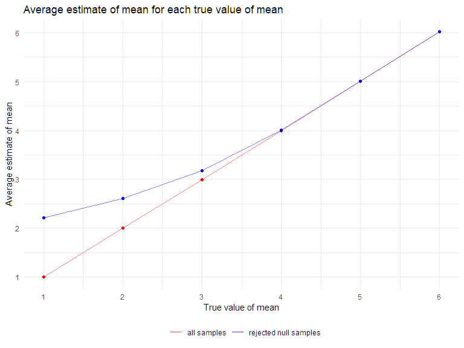

Homework 5
================
Tongtong Zhu
2022-11-12

## Problem 1

### Create a tidy dataframe and manipulate

``` r
longi_df =
  tibble(
    file = list.files("data")) %>% 
  mutate(
    path = str_c("data/", file),
    data = purrr::map(.x = path, ~read_csv(.x))) %>% 
  unnest(data) %>% 
  mutate(id = str_extract(file, "\\d+"),
         id = as.numeric(id),
         arm = str_extract(file, "con|exp")) %>% 
  relocate(id, arm, path,everything()) %>% 
  mutate(arm = recode(arm, con = "control", exp = "experimental")) %>% 
  pivot_longer(
    week_1:week_8,
    names_to = "week",
    names_prefix = "week_",
    values_to = "observation"
  ) %>% 
  mutate(
    id = as.character(id),
    week = as.numeric(week)
  )

longi_df
```

    ## # A tibble: 160 × 6
    ##    id    arm     path            file        week observation
    ##    <chr> <chr>   <chr>           <chr>      <dbl>       <dbl>
    ##  1 1     control data/con_01.csv con_01.csv     1        0.2 
    ##  2 1     control data/con_01.csv con_01.csv     2       -1.31
    ##  3 1     control data/con_01.csv con_01.csv     3        0.66
    ##  4 1     control data/con_01.csv con_01.csv     4        1.96
    ##  5 1     control data/con_01.csv con_01.csv     5        0.23
    ##  6 1     control data/con_01.csv con_01.csv     6        1.09
    ##  7 1     control data/con_01.csv con_01.csv     7        0.05
    ##  8 1     control data/con_01.csv con_01.csv     8        1.94
    ##  9 2     control data/con_02.csv con_02.csv     1        1.13
    ## 10 2     control data/con_02.csv con_02.csv     2       -0.88
    ## # … with 150 more rows

### Make a spaghetti plot

``` r
longi_df %>% 
  ggplot(aes(x = week, y = observation, group = id, color = arm)) +
  geom_point() +
  geom_path() +
  facet_grid(~arm) +
  labs(
      title = "Observations for subjects by group each week"
      )
```


**Comment on difference**

In general, the observation values of the experimental group continue to
increase, while the observation values of the control group are
relatively stable over time. On average, the observation values of the
experimental group are higher than those of the control group. The
difference of observations between two groups gradually increases from
week 2.

## Problem 2

### Describe the raw data

``` r
homicide_raw = read_csv("./data_homi/homicide-data.csv")
```

The `homicide_raw` dataset contains information collected by the
*Washington Post* on criminal homicides over the past decade in 50 of
the largest US cities. It contains 52179 observations and 12 variables.
The key variables include uid, reported_date, victim_last, victim_first,
victim_race, victim_age, victim_sex, city, state, lat, lon, disposition.

### Create `city_state` and `resolution` variables

``` r
homicide_df =
  homicide_raw %>% 
  mutate(
    city_state = str_c(city, state, sep = ", "),
    city_state = recode(city_state, "Tulsa, AL" = "Tulsa, OK"),
    resolved = case_when(
      disposition == "Closed without arrest" ~ "unsolved",
      disposition == "Open/No arrest"        ~ "unsolved",
      disposition == "Closed by arrest"      ~ "solved"
    )) %>% 
  relocate(city_state)

homicide_df
```

    ## # A tibble: 52,179 × 14
    ##    city_state  uid   repor…¹ victi…² victi…³ victi…⁴ victi…⁵ victi…⁶ city  state
    ##    <chr>       <chr>   <dbl> <chr>   <chr>   <chr>   <chr>   <chr>   <chr> <chr>
    ##  1 Albuquerqu… Alb-…  2.01e7 GARCIA  JUAN    Hispan… 78      Male    Albu… NM   
    ##  2 Albuquerqu… Alb-…  2.01e7 MONTOYA CAMERON Hispan… 17      Male    Albu… NM   
    ##  3 Albuquerqu… Alb-…  2.01e7 SATTER… VIVIANA White   15      Female  Albu… NM   
    ##  4 Albuquerqu… Alb-…  2.01e7 MENDIO… CARLOS  Hispan… 32      Male    Albu… NM   
    ##  5 Albuquerqu… Alb-…  2.01e7 MULA    VIVIAN  White   72      Female  Albu… NM   
    ##  6 Albuquerqu… Alb-…  2.01e7 BOOK    GERALD… White   91      Female  Albu… NM   
    ##  7 Albuquerqu… Alb-…  2.01e7 MALDON… DAVID   Hispan… 52      Male    Albu… NM   
    ##  8 Albuquerqu… Alb-…  2.01e7 MALDON… CONNIE  Hispan… 52      Female  Albu… NM   
    ##  9 Albuquerqu… Alb-…  2.01e7 MARTIN… GUSTAVO White   56      Male    Albu… NM   
    ## 10 Albuquerqu… Alb-…  2.01e7 HERRERA ISRAEL  Hispan… 43      Male    Albu… NM   
    ## # … with 52,169 more rows, 4 more variables: lat <dbl>, lon <dbl>,
    ## #   disposition <chr>, resolved <chr>, and abbreviated variable names
    ## #   ¹​reported_date, ²​victim_last, ³​victim_first, ⁴​victim_race, ⁵​victim_age,
    ## #   ⁶​victim_sex

### Summarize total No. of homicides and unsolved homicides within cities

``` r
homi_summary =
  homicide_df %>% 
  group_by(city_state) %>% 
  summarize(
    total_homi = n(),
    homi_unsolved = sum(resolved == "unsolved")
  ) 

homi_summary
```

    ## # A tibble: 50 × 3
    ##    city_state      total_homi homi_unsolved
    ##    <chr>                <int>         <int>
    ##  1 Albuquerque, NM        378           146
    ##  2 Atlanta, GA            973           373
    ##  3 Baltimore, MD         2827          1825
    ##  4 Baton Rouge, LA        424           196
    ##  5 Birmingham, AL         800           347
    ##  6 Boston, MA             614           310
    ##  7 Buffalo, NY            521           319
    ##  8 Charlotte, NC          687           206
    ##  9 Chicago, IL           5535          4073
    ## 10 Cincinnati, OH         694           309
    ## # … with 40 more rows

### Estimate the proportion of unsolved homicides for Baltimore

``` r
balt_prop = 
  prop.test(
    x = homi_summary %>% filter(city_state == "Baltimore, MD") %>% pull(homi_unsolved),
    n = homi_summary %>% filter(city_state == "Baltimore, MD") %>% pull(total_homi)
  )  

balt_prop %>% 
  broom::tidy() %>% 
  select(estimate, conf.low, conf.high)
```

    ## # A tibble: 1 × 3
    ##   estimate conf.low conf.high
    ##      <dbl>    <dbl>     <dbl>
    ## 1    0.646    0.628     0.663

### Estimate proportion and CI for each city

``` r
cities_prop = 
  homi_summary %>%
  mutate(
    prop_test = map2(.x = homi_unsolved, .y = total_homi, ~prop.test(x = .x, n = .y)),
    tidy_test = map(.x = prop_test, ~broom::tidy(.x))
  ) %>% 
  select(city_state, tidy_test) %>% 
  unnest(tidy_test) %>% 
  select(city_state, estimate, conf.low, conf.high)

cities_prop
```

    ## # A tibble: 50 × 4
    ##    city_state      estimate conf.low conf.high
    ##    <chr>              <dbl>    <dbl>     <dbl>
    ##  1 Albuquerque, NM    0.386    0.337     0.438
    ##  2 Atlanta, GA        0.383    0.353     0.415
    ##  3 Baltimore, MD      0.646    0.628     0.663
    ##  4 Baton Rouge, LA    0.462    0.414     0.511
    ##  5 Birmingham, AL     0.434    0.399     0.469
    ##  6 Boston, MA         0.505    0.465     0.545
    ##  7 Buffalo, NY        0.612    0.569     0.654
    ##  8 Charlotte, NC      0.300    0.266     0.336
    ##  9 Chicago, IL        0.736    0.724     0.747
    ## 10 Cincinnati, OH     0.445    0.408     0.483
    ## # … with 40 more rows

### Create a plot showing estimates and CIs

``` r
cities_prop %>% 
  mutate(
    city_state = fct_reorder(city_state, estimate)
  ) %>% 
  ggplot(aes(x = city_state, y = estimate)) +
  geom_point() +
  geom_errorbar(aes(ymin = conf.low, ymax = conf.high)) +
  theme(axis.text.x = element_text(angle = 90, vjust = 0.5, hjust = 1)) +
   labs(
    x = "City, State",
    y = "Proportion of unsolved homicides",
    title = "Estimated Proportions of Unsolved Homicides with 95% CIs for Each City"
   )
```


## Problem 3

### Create a function with default vaule

``` r
sim_t_test = function(n = 30, mu, sigma = 5) {
  
  sim_data = tibble(
    x = rnorm(n, mean = mu, sd = sigma),
  )
  
  sim_data %>% 
    t.test() %>% 
    broom::tidy() %>%
    select(estimate, p.value)
    
}
```

### Generate 5000 datasets from the model with mu=0

``` r
sim_results_mu0 =
  expand_grid(
    mu_value = 0,
    iter = 1:5000
  ) %>% 
  mutate(
    estimate_df = map(.x = mu_value, ~sim_t_test(mu = .x))
  ) %>% 
  unnest(estimate_df)
```

### Repeat the model with several mu={1,2,3,4,5,6}

``` r
sim_results_mu6 =
  expand_grid(
    mu_value = 1:6,
    iter = 1:5000
  ) %>% 
  mutate(
    estimate_df = map(.x = mu_value, ~sim_t_test(mu = .x))
  ) %>% 
  unnest(estimate_df)
```

### Make a plot showing the proportion of null-rejected

``` r
sim_results_mu6 %>% 
  group_by(mu_value) %>% 
  summarize(
    total = n(),
    null_reject = sum(p.value < 0.05)) %>% 
  mutate(
    proportion = null_reject / total
  ) %>%
  ggplot(aes(x = mu_value, y = proportion)) +
  geom_point() +
  geom_line() +
  labs(
    title = "Proportion of null hypothesis rejected for each μ value",
    x = "True value of μ "
  ) +
  scale_x_continuous(
    breaks = 1:6
  )
```


**Description of the association between effect size and power**

The plot shows that as the true value of μ increases, the proportion of
null hypothesis rejected increases, that is, the power increases. As
mentioned in the null hypothesis, the mean equals 0, so as the true mean
increases, the effect size increases. Therefore, the larger the effect
size, the more power the test has.

### Make a plot showing the average estimate of μ vs. its true value

``` r
all_estimate =
  sim_results_mu6 %>% 
  group_by(mu_value) %>% 
  summarize(
    avg_estimate = mean(estimate)
  ) 
```

``` r
rejected_estimate =
sim_results_mu6 %>% 
  filter(p.value < 0.05) %>% 
  group_by(mu_value) %>% 
  summarize(
    avg_estimate = mean(estimate)
  ) 
```

``` r
all_estimate %>% 
  ggplot(aes(x = mu_value, y = avg_estimate)) +
  geom_line(aes(color = "a"), alpha = 0.5) +
  geom_line(data = rejected_estimate, aes(color = "b"), alpha = 0.5) +
  scale_color_manual(name = " ", 
                     values = c("a" = "red","b" = "blue"), 
                     labels = c("all samples","rejected null samples")) +
  geom_point(color = "red") +
  geom_point(data = rejected_estimate, color = "blue") +
  scale_x_continuous(breaks = 1:6) +
  scale_y_continuous(breaks = 1:6) +
   labs(
     title = "Average estimate of mean for each true value of mean",
     x = "True value of mean",
     y = "Average estimate of mean"
   )
```



**Description of the plot**

When true mean μ ={1,2,3}, the sample average of mean across tests for
which the null is rejected is not approximately equal to the true mean.
When the true mean μ ={4,5,6}, the sample average of mean (null
rejected) is approximately equal to the true mean.

It is because smaller effect size corresponds to smaller power. We
reject the null hypothesis when the estimated values of samples are
significantly different from the null (μ=0). When the true mean is less
than 4, the effect size is relatively small and the power is not big
enough to find all the statistically significant difference between
samples and true values. So when the true mean is less than 4, not all
samples with significant difference are rejected, and thus the sample
average of mean (for which the null is rejected) is different with the
true mean. However, when the true mean is equal to or larger than 4, the
effect size is larger and the power is big enough to find all the
statistically significant difference and almost reject all the samples
in this case. Therefore, the sample average of mean (for which the null
is rejected) equals to the true mean.
